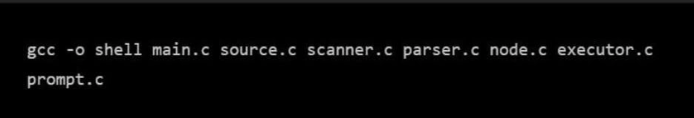
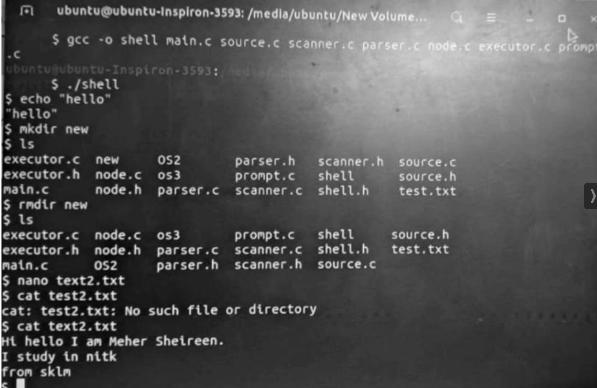
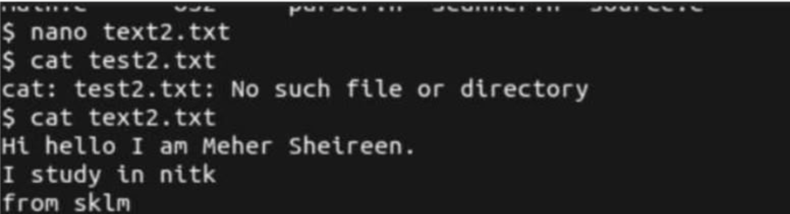
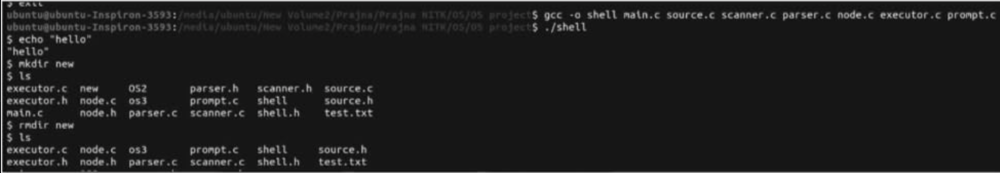
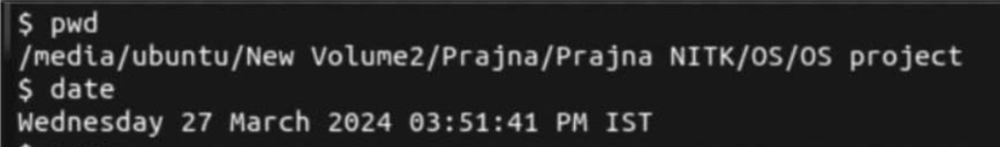

 # C-Based Linux Shell
## Overview

This project implements a custom Linux shell in C that replicates the core functionality of Unix shells such as Bash. The shell supports command execution, process management, piping, input/output redirection, background execution, and built-in commands using Linux system calls.

## Features

- Command execution
- Built-in shell commands
- Input and output redirection
- Command piping
- Background process execution
- Process management
- Command history
- Linux system calls

  ## Technologies

- C
- Linux
- POSIX System Calls
- Make
- GCC

## how to run
On your Bash Terminal run
```
>  make
> ./shell
```
## Demo

### Compilation and Execution

This demonstrates compiling the shell using `make` and launching the executable.



---

### Basic Shell Commands

The shell successfully executes commands such as `echo`, `mkdir`, `ls`, and `rmdir`.



---

### File Operations

Demonstration of creating and reading files using built-in shell commands.



---

### Additional Shell Operations

Examples of command execution and directory operations.



---

### Built-in Commands

Execution of built-in commands such as `pwd` and `date`.


